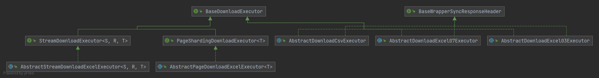

# EasyFile

### 介绍

EasyFile-是为了提供更加便捷的文件服务,可以提供统一的操作入口

目前主要支持导出功能

支持同步导出、异步导出、文件压缩、流式导出、分页导出等特性。

优化缓解导出文件时对服务的内存和CPU影响。针对文件服务可做更多的管理。

提供给开发者更加通用、快捷、统一的实现的API方案；

### 软件架构

EasyFile 提供两种模式

local 模式:  需要提供本地的api 存储Mapper. 将数据存储到本地数据库中管理。

remote模式：需要部署easyfile-server 服务，并设置客户端调用远程EasyFile 的域名。

### 使用教程

#### 一、引入maven依赖

如果使用本地模式 引入maven

```xml
<dependency>
   <groupId>org.svnee</groupId>
    <artifactId>easyfile-spring-boot-starter</artifactId>
    <version>1.0.0</version>
</dependency>
<dependency>
   <groupId>org.svnee</groupId>
   <artifactId>easyfile-local-storage</artifactId>
   <version>1.0.0</version>
</dependency>
```

如果使用远程模式引入maven 依赖

```xml
<dependency>
   <groupId>org.svnee</groupId>
    <artifactId>easyfile-spring-boot-starter</artifactId>
    <version>1.0.0</version>
</dependency>
<dependency>
   <groupId>org.svnee</groupId>
   <artifactId>easyfile-remote-storage</artifactId>
   <version>1.0.0</version>
</dependency>
```

#### 二、Client端需要提供文件上传服务进行实现接口

```java
package org.svnee.easyfile.storage.file;

import java.io.File;
import org.svnee.easyfile.common.bean.Pair;

/**
 * 文件上传服务
 *
 * @author svnee
 */
public interface UploadService {

    /**
     * 文件上传
     * 如果需要重试则需要抛出 org.svnee.easyfile.starter.exception.GenerateFileException
     *
     * @param file 文件
     * @param fileName 自定义生成的文件名
     * @param appId 服务ID
     * @return key: 文件系统 --> value:返回文件URL/KEY标识符
     */
    Pair<String, String> upload(File file, String fileName, String appId);

}
```

将文件上传到自己的文件存储服务

#### 三、额外处理

如果是使用Local模式，需要提供Client配置

```properties
##### easyfile-local-datasource
easyfile.local.datasource.type=com.zaxxer.hikari.HikariDataSource
easyfile.local.datasource.driver-class-name=com.mysql.cj.jdbc.Driver
easyfile.local.datasource.url=jdbc:mysql://localhost:3306/test?characterEncoding=utf-8&zeroDateTimeBehavior=convertToNull&transformedBitIsBoolean=true&serverTimezone=GMT%2B8
easyfile.local.datasource.username=root
easyfile.local.datasource.password=123456
```

需要执行SQL:

```sql
CREATE TABLE ef_async_download_task
(
    id                BIGINT (20) UNSIGNED NOT NULL AUTO_INCREMENT COMMENT 'id',
    task_code         VARCHAR(50) NOT NULL DEFAULT '' COMMENT '任务编码',
    task_desc         VARCHAR(50) NOT NULL DEFAULT '' COMMENT '任务描述',
    app_id            VARCHAR(50) NOT NULL DEFAULT '' COMMENT '归属系统 APP ID',
    unified_app_id    VARCHAR(50) NOT NULL DEFAULT '' COMMENT '统一APP ID',
    enable_status     TINYINT (3) NOT NULL DEFAULT 0 COMMENT '启用状态',
    limiting_strategy VARCHAR(50) NOT NULL DEFAULT '' COMMENT '限流策略',
    version           INT (10) NOT NULL DEFAULT 0 COMMENT '版本号',
    create_time       TIMESTAMP   NOT NULL DEFAULT CURRENT_TIMESTAMP COMMENT '创建时间',
    update_time       TIMESTAMP   NOT NULL DEFAULT CURRENT_TIMESTAMP ON UPDATE CURRENT_TIMESTAMP COMMENT '更新时间',
    create_by         VARCHAR(50) NOT NULL DEFAULT '' COMMENT '创建人',
    update_by         VARCHAR(50) NOT NULL DEFAULT '' COMMENT '更新人',
    is_deleted        BIGINT (20) NOT NULL DEFAULT 0 COMMENT '是否删除',
    PRIMARY KEY (id),
    UNIQUE KEY `uniq_app_id_task_code` (`task_code`,`app_id`) USING BTREE
)ENGINE=InnoDB DEFAULT CHARSET=utf8mb4 COMMENT '异步下载任务';

CREATE TABLE ef_async_download_record
(
    id                    BIGINT (20) UNSIGNED NOT NULL AUTO_INCREMENT COMMENT 'id',
    download_task_id      BIGINT (20) NOT NULL DEFAULT 0 COMMENT '下载任务ID',
    app_id                VARCHAR(50)  NOT NULL DEFAULT '' COMMENT 'app ID',
    download_code         VARCHAR(50)  NOT NULL DEFAULT '' COMMENT '下载code',
    upload_status         VARCHAR(50)  NOT NULL DEFAULT '' COMMENT '上传状态',
    file_url              VARCHAR(50)  NOT NULL DEFAULT '' COMMENT '文件路径',
    file_system           VARCHAR(50)  NOT NULL DEFAULT '' COMMENT '文件所在系统',
    download_operate_by   VARCHAR(50)  NOT NULL DEFAULT '' COMMENT '下载操作人',
    download_operate_name VARCHAR(50)  NOT NULL DEFAULT '' COMMENT '下载操作人',
    remark                VARCHAR(50)  NOT NULL DEFAULT '' COMMENT '备注',
    notify_enable_status  TINYINT (3) NOT NULL DEFAULT 0 COMMENT '通知启用状态',
    notify_email          VARCHAR(50)  NOT NULL DEFAULT '' COMMENT '通知有效',
    max_server_retry      INT (3) NOT NULL DEFAULT 0 COMMENT '最大服务重试',
    current_retry         INT (3) NOT NULL DEFAULT 0 COMMENT '当前重试次数',
    execute_param         TEXT NULL COMMENT '重试执行参数',
    error_msg             VARCHAR(256) NOT NULL DEFAULT '' COMMENT '异常信息',
    last_execute_time     DATETIME NULL COMMENT '最新执行时间',
    invalid_time          DATETIME NULL COMMENT '链接失效时间',
    download_num          INT (3) NOT NULL DEFAULT 0 COMMENT '下载次数',
    version               INT (10) NOT NULL DEFAULT 0 COMMENT '版本号',
    create_time           TIMESTAMP    NOT NULL DEFAULT CURRENT_TIMESTAMP COMMENT '创建时间',
    update_time           TIMESTAMP    NOT NULL DEFAULT CURRENT_TIMESTAMP ON UPDATE CURRENT_TIMESTAMP COMMENT '更新时间',
    create_by             VARCHAR(50)  NOT NULL DEFAULT '' COMMENT '创建人',
    update_by             VARCHAR(50)  NOT NULL DEFAULT '' COMMENT '更新人',
    PRIMARY KEY (id),
    KEY `idx_download_operate_by` (`download_operate_by`) USING BTREE,
    KEY `idx_operator_record` (`download_operate_by`,`app_id`,`create_time`),
    KEY `idx_upload_invalid` (`upload_status`,`invalid_time`,`id`)
)ENGINE=InnoDB DEFAULT CHARSET=utf8mb4 COMMENT '异步下载记录';
```

如果是使用remote服务，需要部署easyfile-server 服务,Client提供配置

```properties
#### easyfile-remote-storage
easyfile.remote.username=example
easyfile.remote.password=example
easyfile.remote.server-addr=127.0.0.1:8080
easyfile.remote.namespace=remote-example
```

#### 四、客户端配置

如果使用默认异步文件处理器(`org.svnee.easyfile.starter.executor.impl.DefaultAsyncFileHandler`)

提供了一些配置

| 配置key                                                      | 描述                                | 默认值 |
| ------------------------------------------------------------ | ----------------------------------- | ------ |
| easyfile.default.async.download.handler.thread-pool.core-pool-size | 默认下载线程池核心线程数            | 10     |
| easyfile.default.async.download.handler.thread-pool.maximum-pool-size | 默认下载线程池最大线程池数          | 20     |
| easyfile.default.async.download.handler.thread-pool.keep-alive-time | 默认下载线程池最大空闲时间 单位：秒 | 30     |
| easyfile.default.async.download.handler.thread-pool.max-blocking-queue-size | 默认下载线程池阻塞队列最大长度      | 2048   |

Client 配置

| 配置key                                   | 描述                                                         | 默认值            |
| ----------------------------------------- | ------------------------------------------------------------ | ----------------- |
| easyfile.download.enabled                 | EasyFile是否启用                                             | true              |
| easyfile.download.app-id                   | Client端 AppId                                               |                   |
| easyfile.download.unified-app-id            | Client端统一AppId                                            |                   |
| easyfile.download.local-file-temp-path       | Client端下载文件本地临时目录                                 | /tmp              |
| easyfile.download.enable-auto-register      | Client端自动注册下载任务开关                                 | false             |
| easyfile.download.enable-compress-file      | Client 是否开启文件压缩优化                                  | false             |
| easyfile.download.min-enable-compress-mb-size | Client 启用文件压缩最小的大小，单位:MB 在启用文件压缩后生效 | 1                 |
| easyfile.download.export-advisor-order      | Client下载切面顺序                                           | Integer.MAX_VALUE |


#### 五、实现下载器

实现接口：`org.svnee.easyfile.starter.executor.BaseDownloadExecutor`

并注入到Spring ApplicationContext中，并使用注解 `org.svnee.easyfile.common.annotation.FileExportExecutor`

如果需要支持同步导出，需要设置文件的HttpResponse 请求头，需要实现接口 `org.svnee.easyfile.starter.executor.BaseWrapperSyncResponseHeader`

例如：

```java
import org.springframework.stereotype.Component;
import org.svnee.easyfile.common.annotation.FileExportExecutor;
import org.svnee.easyfile.common.bean.DownloaderRequestContext;
import org.svnee.easyfile.starter.executor.BaseDownloadExecutor;
import org.svnee.easyfile.starter.executor.BaseWrapperSyncResponseHeader;

@Component
@FileExportExecutor("ExampleExcelExecutor")
public class ExampleExcelExecutor implements BaseDownloadExecutor,BaseWrapperSyncResponseHeader {

    @Override
    public boolean enableAsync(DownloaderRequestContext context) {
        // 判断是否开启异步
        return true;
    }

    @Override
    public void export(DownloaderRequestContext context) {
        // 生成文件下载逻辑
    }
}
```

#### 拓展

类继承关系图


##### 下载器

1、分页下载支持

`org.svnee.easyfile.starter.executor.PageShardingDownloadExecutor`

提供更加方便的分页支持

`org.svnee.easyfile.starter.executor.impl.AbstractPageDownloadExcelExecutor`

需要配合使用（`org.svnee.easyfile.common.annotation.ExcelProperty`）

2、流式下载支持

`org.svnee.easyfile.starter.executor.StreamDownloadExecutor`

提供更加方便的流式支持

`org.svnee.easyfile.starter.executor.impl.AbstractStreamDownloadExcelExecutor`

需要配合使用(`org.svnee.easyfile.common.annotation.ExcelProperty`)

##### 限流执行器

如需限流需要实现ExportLimitingExecutor

```java
package org.svnee.easyfile.storage.expand;

import org.svnee.easyfile.common.request.ExportLimitingRequest;

/**
 * 限流服务
 *
 * @author svnee
 */
public interface ExportLimitingExecutor {

    /**
     * 策略
     *
     * @return 策略code码
     */
    String strategy();

    /**
     * 限流
     *
     * @param request request
     */
    void limit(ExportLimitingRequest request);
}
```

#### easyfile-server 部署

1、执行存储DB SQL \
2、部署服务


