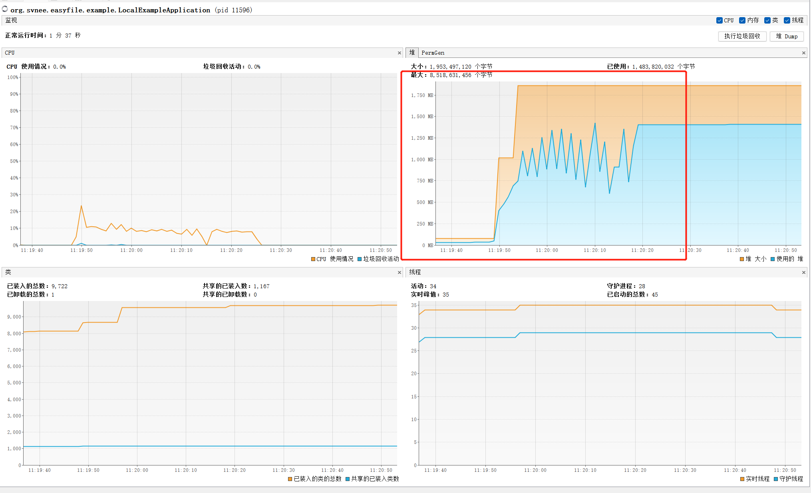
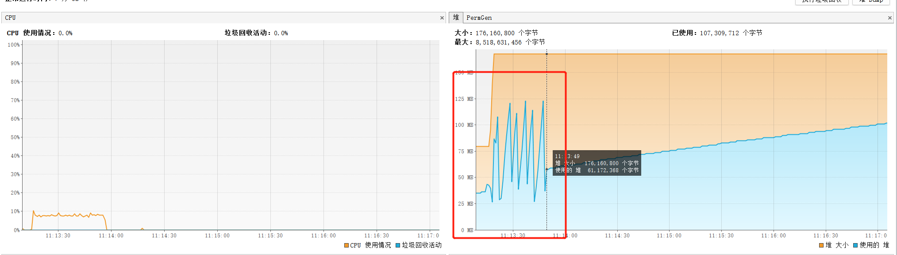
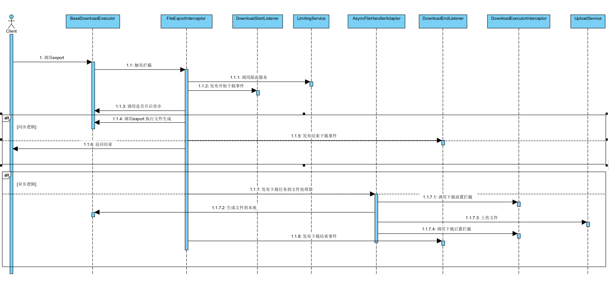

 Make BigData Export Easier!!! 

-------

# EasyFile

[English](./README.md)

Make BigData Export Easier!!!

> **注意**：本项目未发布到maven中央仓库，需要手动添加到本地仓库 或者 到私有仓库中使用。

## 欢迎Star!!!

**[主页](https://openquartz.github.io/)** \
**[GitHub](https://github.com/openquartz/easy-file)**

### 介绍

#### 什么是EasyFile

EasyFile-是为了提供更加便捷的文件服务,一整套Web大文件导出解决方案。可以轻松导出千万以上数据

#### 功能特性

支持（同步、异步）导出、文件压缩、流式导出、分页导出、导出缓存复用、多组分页导出、多组流式导出、多种异步触发机制 等特性。同时支持i18n国际化导出(根据不同的语言环境展示不同的Excel表头)。

优化缓解导出文件时对服务的内存和CPU影响。针对文件服务可做更多的管理。

提供给开发者更加通用、快捷、统一的实现的API方案；

### 解决问题

1、瞬时加载数据过大导致内存飙高不够平滑机器宕机风险很大

2、生成较大文件容易出现HTTP 超时，造成导出失败

3、相同条件的导出结果无法做到复用，需要继续生成导出文件资源浪费

4、导出任务集中出现没有可监控机制

5、开发者不仅需要关心数据查询逻辑同时需要关心文件生成逻辑

6、导出耗时过长时,无法查看到执行进度

### 框架对比

与 Alibaba 的EasyExcel 相比,两者侧重点不同。

Alibaba EasyExcel 是一个Excel文件生成导出、导入 解析工具。

EasyFile 是一个大文件导出的解决方案。用于解决大文件导出时遇到的，文件复用，文件导出超时，内存溢出，瞬时CPU 内存飙高等等问题的一整套解决方案。
同时EasyFile 不仅可以用于Excel
文件的导出,也可以用于csv,pdf,word 等文件导出的管理（暂时需要用户自己集成基础导出下载类BaseDownloadExecutor 实现文件生成逻辑）。

而且,EasyFile和Alibaba EasyExcel 并不冲突，依然可以结合EasyExcel 使用,文件生成逻辑使用Alibaba EasyExcel 做自行拓展使用。

1、使用全量查出100w数据+EasyExcel导出(`com.openquartz.easyfile.example.downloader.StudentDownloadDemoExecutor`)
内存图：

2、使用分页导出(`com.openquartz.easyfile.example.downloader.StudentPageDownloadDemoExecutor`)
内存图

生成的文件大小比对:

### 软件架构

EasyFile 提供两种模式

**Local模式(推荐)**:  需要提供本地的api 存储Mapper. 将数据存储到本地数据库中管理。

**Remote模式**：需要部署easyfile-server 服务，并设置客户端调用远程EasyFile 的域名。

### 代码结构

- `easyfile-common`: 公共模块服务
- `easyfile-core` : 核心服务
- `easyfile-metrics` : metrics支持
    - `easyfile-metrics-api` :  metrics-api 协议
    - `easyfile-metrics-promethes` : metrics-promethes 实现
- `easyfile-storage`: 存储服务
    - `easyfile-storage-api`: 存储服务API
    - `easyfile-storage-remote`: 远程调用存储
    - `easyfile-storage-local`: 本地数据源存储

- `easyfile-spring-boot-starter`: easyfile starter 包 工程module集合
    - `easyfile-spring-boot-starter-parent`: easyfile starter parent 工程
    - `easyfile-spring-boot-starter-local`: easyfile local 模式 starter工程包
    - `easyfile-spring-boot-starter-remote`: easyfile remote 模式 starter工程包

- `easyfile-server`: easyfile 远程存储服务端

- `easyfile-ui`: easyfile-admin ui-管理服务 (可选)

- `easyfile-example`: 样例工程
    - `easyfile-example-local`: 本地储存样样例工程
    - `easyfile-example-remote`: 远程存储样例工程

### 时序图

### 快速开始

[快速开始](doc/QuickStart_zh.md)

### 推广

If you also think this project has helped you, welcome to sign up for the promotion!

[Click to register as EasyFile user!](https://github.com/openquartz/easy-file/issues/1)

ღ( ´・ᴗ・` )ღ Many thanks to the following registered users. ღ( ´・ᴗ・` )ღ

## 🌟Misc

