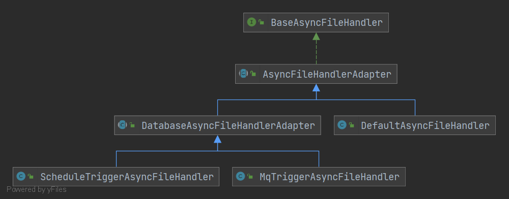
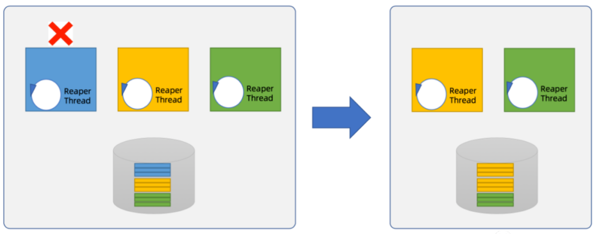

## 异步文件处理器

**类继承关系图**


异步文件处理器提供了适配器，需要实现`org.svnee.easyfile.core.executor.BaseAsyncFileHandler`

系统针对 提供了默认的适配器实现，只需要继承(`org.svnee.easyfile.core.executor.AsyncFileHandlerAdapter`)，并提供对应的自定义的实现即可。

系统提供了三种触发方式(线程池、DB-Schedule、DB-MQ)

### 线程池处理器

同时EasyFile 提供了默认实现(`org.svnee.easyfile.starter.trigger.handler.DefaultAsyncFileHandler`),使用线程池触发做异步文件处理器 \
同时提供对应的Client配置,需要配置(`easyfile.download.async-trigger-type=default`)

| 配置key                                                      | 描述                                | 默认值 |
| ------------------------------------------------------------ | ----------------------------------- | ------ |
| easyfile.default.async.download.handler.thread-pool.core-pool-size | 默认下载线程池核心线程数            | 10     |
| easyfile.default.async.download.handler.thread-pool.maximum-pool-size | 默认下载线程池最大线程池数          | 20     |
| easyfile.default.async.download.handler.thread-pool.keep-alive-time | 默认下载线程池最大空闲时间 单位：秒 | 30     |
| easyfile.default.async.download.handler.thread-pool.max-blocking-queue-size | 默认下载线程池阻塞队列最大长度      | 2048   |

### DB 触发器

目前仅支持文件处理器使用**本地模式**。暂不支持**remote模式**。如果使用需要依赖maven pom 为
```xml
<dependency>
    <groupId>org.svnee</groupId>
    <artifactId>easyfile-spring-boot-starter</artifactId>
    <version>1.0.0</version>
</dependency>
<dependency>
   <groupId>org.svnee</groupId>
   <artifactId>easyfile-storage-local</artifactId>
   <version>1.0.0</version>
</dependency>
```

使用DB触发处理器。需要依赖DB使用。 因此需要DB数据源执行建表-SQL

```sql
CREATE TABLE ef_async_download_trigger
(
    id                BIGINT (20) NOT NULL AUTO_INCREMENT COMMENT 'Id',
    register_id       BIGINT (20) NOT NULL DEFAULT -1 COMMENT '注册ID',
    trigger_status    VARCHAR(50) NOT NULL DEFAULT '' COMMENT '触发状态',
    start_time        DATETIME    NOT NULL COMMENT '开始时间',
    last_execute_time DATETIME    NOT NULL COMMENT '最新执行时间',
    trigger_count     INT (3) NOT NULL DEFAULT 0 COMMENT '触发次数',
    creating_owner    varchar(50) not null default '' comment '触发者',
    processing_owner  varchar(50) not null default '' comment '执行者',
    UNIQUE `ux_register_id`(register_id),
    PRIMARY KEY (id)
)ENGINE=InnoDB DEFAULT CHARSET=utf8mb4 COMMENT '触发执行';
```

#### DB-Schedule处理器

##### DB+Schedule
用户使用基于DB 的实现(`org.svnee.easyfile.starter.spring.boot.autoconfig.properties.ScheduleAsyncHandlerProperties`)可以
配置对应的properties 即可使用

默认配置有 需要开启`easyfile.download.async-trigger-type=schedule`

```properties
easyfile.schedule.async.download.handler.enable=true
easyfile.schedule.async.download.handler.thread-pool-core-pool-size=2
easyfile.schedule.async.download.handler.thread-pool-thread-prefix=ScheduleAsyncHandler
easyfile.schedule.async.download.handler.max-execute-timeout=1600
easyfile.schedule.async.download.handler.max-trigger-count=5
easyfile.schedule.async.download.handler.schedule-period=10
easyfile.schedule.async.download.handler.trigger-offset=50
easyfile.schedule.async.download.handler.look-back-hours=2
easyfile.schedule.async.download.handler.max-archive-hours=24
```

| 配置key                                                      | 描述                                | 默认值 |
| ------------------------------------------------------------ | ----------------------------------- | ------ |
| easyfile.schedule.async.download.handler.enable | 是否启用调度式异步处理器            | false    |
| easyfile.schedule.async.download.handler.thread-pool-core-size | 调度处理器单机核心线程数          | 2     |
| easyfile.schedule.async.download.handler.thread-pool-thread-prefix | 调度处理器线程前缀  |    ScheduleAsyncHandler  |
| easyfile.schedule.async.download.handler.max-execute-timeout | 调度处理一次最大超时 单位：秒 | 1600   |
| easyfile.schedule.async.download.handler.max-trigger-count | 最大调度重试次数  | 5   |
| easyfile.schedule.async.download.handler.schedule-period | 调度周期 单位：秒 | 10   |
| easyfile.schedule.async.download.handler.trigger-offset | 触发调度一次触发量   |  50   |
| easyfile.schedule.async.download.handler.look-back-hours | 一次回溯处理时间 单位：小时 | 2   |
| easyfile.schedule.async.download.handler.max-archive-hours | 已经执行完成的归档保持时间 单位：小时 | 24   |

##### Reaper机制



DB-调度使用Reaper线程进行调度,增加高可用以及调度效率。避免重复调度冲突

#### DB-MQ处理器

##### disruptor+补偿模式

使用disruptor+补偿模式,系统提供基于Disruptor的触发处理器(`org.svnee.easyfile.starter.trigger.handler.MqTriggerAsyncFileHandler`)。\
需要开启配置为`easyfile.download.async-trigger-type=disruptor`

```properties
easyfile.disruptor.async.download.handler.look-back-hours=2
easyfile.disruptor.async.download.handler.max-archive-hours=24
easyfile.disruptor.async.download.handler.max-execute-timeout=1600
easyfile.disruptor.async.download.handler.max-trigger-count=5
easyfile.disruptor.async.download.handler.ring-buffer-size=64
easyfile.disruptor.async.download.handler.schedule-period=10
easyfile.disruptor.async.download.handler.thread-pool-thread-prefix=DisruptorAsyncHandler
```

##### RocketMQ

使用MQ 处理器,系统提供的是基于RocketMQ的触发处理(`org.svnee.easyfile.starter.trigger.handler.MqTriggerAsyncFileHandler`)。因此需要提供依赖jar (
rocket-client)

```xml

<dependency>
    <groupId>org.apache.rocketmq</groupId>
    <artifactId>rocketmq-client</artifactId>
    <version>4.9.3</version>
</dependency>
```

同时开启配置`easyfile.download.async-trigger-type=rocketmq`

```properties
easyfile.rocketmq.async.download.handler.host=127.0.0.1.9876
easyfile.rocketmq.async.download.handler.topic=easyfile_mq_trigger
easyfile.rocketmq.async.download.handler.produce-group=p_async_handler_group
easyfile.rocketmq.async.download.handler.produce-latency-fault-enable=true
easyfile.rocketmq.async.download.handler.produce-timeout=1000
easyfile.rocketmq.async.download.handler.produce-try-times=5
easyfile.rocketmq.async.download.handler.consumer-group=c_async_handler_group
easyfile.rocketmq.async.download.handler.consumer-max-thread=3
easyfile.rocketmq.async.download.handler.consumer-min-thread=1
easyfile.rocketmq.async.download.handler.consume-concurrently-max-span=10
easyfile.rocketmq.async.download.handler.look-back-hours=2
easyfile.rocketmq.async.download.handler.offset=500
easyfile.rocketmq.async.download.handler.schedule-period=10
easyfile.rocketmq.async.download.handler.max-archive-hours=24
easyfile.rocketmq.async.download.handler.max-execute-timeout=1600
easyfile.rocketmq.async.download.handler.max-trigger-count=5
easyfile.rocketmq.async.download.handler.max-waiting-timeout=1600
```

##### 使用其他MQ触发实现

1、基于通过实现`org.svnee.easyfile.core.executor.trigger.MQTriggerProducer`
实现基于其他MQ的触发。

2 、实现自定义监听MQ-触发消息处理逻辑

3、手动注入相关类到spring context 中。
包括：(`org.svnee.easyfile.starter.spring.boot.autoconfig.MqAsyncFileHandlerAutoConfiguration`)中的相关类的实现。


