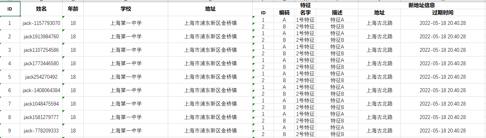
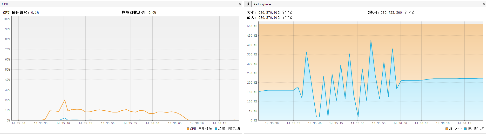

## 下载器

实现接口：`org.svnee.easyfile.starter.executor.BaseDownloadExecutor`

并注入到Spring ApplicationContext中，并使用注解 `org.svnee.easyfile.common.annotations.FileExportExecutor`

如果需要支持同步导出，需要设置文件的HttpResponse 请求头，需要实现接口 `org.svnee.easyfile.starter.executor.BaseWrapperSyncResponseHeader`

例如：

```java
import org.springframework.stereotype.Component;
import org.svnee.easyfile.common.annotations.FileExportExecutor;
import org.svnee.easyfile.common.bean.DownloaderRequestContext;
import org.svnee.easyfile.starter.executor.BaseDownloadExecutor;
import org.svnee.easyfile.starter.executor.BaseWrapperSyncResponseHeader;

@Component
@FileExportExecutor("ExampleExcelExecutor")
public class ExampleExcelExecutor implements BaseDownloadExecutor, BaseWrapperSyncResponseHeader {

  @Override
  public boolean enableAsync(DownloaderRequestContext context) {
    // 判断是否开启异步
    return true;
  }

  @Override
  public void export(DownloaderRequestContext context) {
    // 生成文件下载逻辑
  }
}
```

类继承关系图


#### 下载器概览

1、分页下载支持

`org.svnee.easyfile.starter.executor.PageShardingDownloadExecutor`

提供更加方便的分页支持

`org.svnee.easyfile.starter.executor.impl.AbstractPageDownloadExcelExecutor`

需要配合使用（`org.svnee.easyfile.common.annotations.ExcelProperty`）

多Sheet组下载支持
`org.svnee.easyfile.starter.executor.impl.AbstractMultiSheetPageDownloadExcelExecutor`

2、流式下载支持

`org.svnee.easyfile.starter.executor.StreamDownloadExecutor`

提供更加方便的流式支持

`org.svnee.easyfile.starter.executor.impl.AbstractStreamDownloadExcelExecutor`

多Sheet组下载支持
`org.svnee.easyfile.starter.executor.impl.AbstractMultiSheetStreamDownloadExcelExecutor`

需要配合使用(`org.svnee.easyfile.common.annotations.ExcelProperty`)

#### Excel增强器支持
Excel针对使用系统框架的导出生成的Excel提供了扩展增强支持。用于用户自主增强一些自定义的功能,例如：加密、只读锁定、水印等。
用户可以实现 `org.svnee.easyfile.starter.executor.excel.ExcelIntensifier` 以实现自己的增强功能
例如：
```java
package org.svnee.easyfile.example.excel;

import java.io.IOException;
import lombok.extern.slf4j.Slf4j;
import org.apache.poi.ss.usermodel.Workbook;
import org.apache.poi.xssf.streaming.SXSSFWorkbook;
import org.apache.poi.xssf.usermodel.XSSFWorkbook;
import org.svnee.easyfile.common.bean.BaseDownloaderRequestContext;
import org.svnee.easyfile.example.utils.WaterMarkExcelUtil;
import org.svnee.easyfile.starter.executor.excel.ExcelIntensifier;

/**
 * 增强水印
 * @author svnee
 **/
@Slf4j
public class WaterMarkExcelIntensifier implements ExcelIntensifier {

    @Override
    public void enhance(Workbook workbook, BaseDownloaderRequestContext context) {

        if (workbook instanceof XSSFWorkbook) {
            try {
                WaterMarkExcelUtil.printWaterMark((XSSFWorkbook) workbook, "敏感内容");
            } catch (IOException e) {
                log.error("[WaterMarkExcelIntensifier#enhance]", e);
            }
        } else if (workbook instanceof SXSSFWorkbook) {
            try {
                WaterMarkExcelUtil.printWaterMark((SXSSFWorkbook) workbook, "敏感内容");
            } catch (IOException e) {
                log.error("[WaterMarkExcelIntensifier#enhance]", e);
            }
        } else {
            throw new RuntimeException("this workbook not support watermark!");
        }
    }
}
```
使用时,覆盖提供Excel增强器
```java
@Component
@FileExportExecutor(value = "StudentPageDownloadDemoExecutor")
public class StudentPageDownloadDemoExecutor extends AbstractPageDownloadExcelExecutor<Student> {

  @Resource
  private StudentMapper studentMapper;

  @Override
  public boolean enableAsync(BaseDownloaderRequestContext context) {
    return true;
  }

  @Override
  public String sheetPrefix() {
    return "学生信息";
  }

  @Override
  public PageTotal count(Map<String, Object> othersMap) {
    if (PageTotalContext.currentPageToTal(sheetPrefix()) != null) {
      return PageTotalContext.currentPageToTal(sheetPrefix());
    }
    int count = studentMapper.count();
    PageTotalContext.cache(sheetPrefix(), PageTotal.of(count, 100));
    return PageTotalContext.currentPageToTal(sheetPrefix());
  }

  @Override
  public Pair<Long, List<Student>> shardingData(BaseDownloaderRequestContext context, Page page, Long cursorId) {
    List<Student> studentList = studentMapper.findByMinIdLimit(cursorId, page.getPageSize());
    if (CollectionUtils.isEmpty(studentList)) {
      return Pair.of(cursorId, studentList);
    }
    cursorId = studentList.get(studentList.size() - 1).getId();
    return Pair.of(cursorId, studentList);
  }

  /**
   * 水印打印
   */
  @Override
  public List<ExcelIntensifier> enhanceExcel() {
    return Collections.singletonList(new WaterMarkExcelIntensifier());
  }
}
```

#### 限流执行器

如需限流需要实现ExportLimitingExecutor

```java
package org.svnee.easyfile.storage.expand;

import org.svnee.easyfile.common.request.ExportLimitingRequest;

/**
 * 限流服务
 *
 * @author svnee
 */
public interface ExportLimitingExecutor {

  /**
   * 策略
   *
   * @return 策略code码
   */
  String strategy();

  /**
   * 限流
   *
   * @param request request
   */
  void limit(ExportLimitingRequest request);
}
```

#### 缓存开启

导出结果缓存,主要是为了能够复用大文件的导出,减少不必要的相同数据的进行多次重复导出。以此尽可能的复用已经成功导出的结果。

导出的数据主要分成三种：\
1、静态数据(已经是过去数据,不在发生变化,相同条件多次导出结果一致) \
2、动态数据(正在发生的数据,数据一直在改变,相同条件多次导出结果不一致) \
3、静态数据+动态数据(部分数据已经不在改变、部分数据依旧在改变)

导出结果缓存 主要适用在第一种情况的场景

1、需要实现时,重写开启缓存方法

```java
/**
 * 开启导出缓存
 *
 * @param context context
 * @return 是否开启缓存
 */
default boolean enableExportCache(BaseDownloaderRequestContext context){
        return false;
}
```

2、提供需要判定缓存的key的结果-用于比较是否一致.如果cache-key 为空时,则缓存为匹配所有

```java
/**
 * 文件导出执行器
 *
 * @author svnee
 */
@Target({ElementType.TYPE})
@Retention(RetentionPolicy.RUNTIME)
@Inherited
public @interface FileExportExecutor {

  /**
   * 执行器code
   */
  String value();

  /**
   * 执行器中文解释
   * 默认是{@link #value()}
   */
  String desc() default "";

  /**
   * 是否开启通知
   */
  boolean enableNotify() default false;

  /**
   * 最大服务端重试次数
   * 小于等于0时不在执行重试。
   */
  int maxServerRetry() default 0;

  /**
   * cache-key
   *
   * @see BaseDownloaderRequestContext#getOtherMap() 中的key的对应的value值
   * 如果有值则可以使用点使用指向最终的数据字段。例如：a.b.c
   * 支持SpringEL表达式
   */
  String[] cacheKey() default {};
}

// 例如
@FileExportExecutor(value = "studentStreamDownloadDemo", desc = "Student导出", cacheKey = {"#request.age"})
```

#### 子列单元格导出支持

目前针对 1:* 的映射导出 只支持及到两级,暂时不支持三级及以上(即：1：* ：* ) \
excel的导出支持1:* 的数据单元行列的导出。例如：\

但是针对\
1、1：* 的导出数据时,不建议导出过多数据,由于需要merge 单元格的原因,导致导出生成excel时很慢,建议数量小于 2K行

2、针对特别大的数据时,建议使用1:1的单元格导出 \


#### 多Sheet分组导出支持

需要按照多个Sheet进行分组查询导出 导出数据形如,


EasyFile 提供两个执行器

- 流式-多Sheet组导出
  `org.svnee.easyfile.starter.executor.impl.AbstractMultiSheetStreamDownloadExcelExecutor`

- 分页-多Sheet组导出
  `org.svnee.easyfile.starter.executor.impl.AbstractMultiSheetPageDownloadExcelExecutor`

#### 优化建议

针对大文件导出功能目前easyfile 提供两种处理方式 分页导出/流式导出。\
1、但是针对大文件导出时建议将单sheet的最大行数设置的比较大,甚至设置成07版本excel的单sheet最大行数,避免频繁创建单Sheet导致内存无法回收OOM
配置为: `easyfile.download.excel-max-sheet-rows` \
2、针对大文件导出时可适量的根据内存本身的大小做设定excel缓存在内存中的行数。不建议设置特别大 配置为: `easyfile.download.excel-row-access-window-size` \
设置过大,会对内存有一定的压力。过小则会频繁的刷新数据到磁盘中,CPU容器上升。\
3、针对分页/流式导出 使用时设置一次查询行数,需要合理设置 \
分页导出时,需要注意分页的分页大小的设置 \
流式导出时,需要注意增强数据缓存的长度即方法`org.svnee.easyfile.starter.executor.impl.AbstractStreamDownloadExcelExecutor.enhanceLength`

#### 内存性能验证

使用本地存储模式 启动参数`-Xms512M -Xmx512M -Xmn512M -Xss1M -XX:MetaspaceSize=256M -XX:MaxMetaspaceSize=256M` \
导出数据行数100w,生成文件大小30079kb excel(2007版本) \
设置分页/流式buf 一次长度设置100 \
使用配置：

```properties
easyfile.download.excel-max-sheet-rows=10000000
easyfile.download.excel-row-access-window-size=100
```

使用分页导出CPU/内存情况 \
 \
使用流式导出CPU/内存情况 \


#### 异步导出执行进度支持

针对异步导出大文件时,可以进行实时的上报执行进度。入口`org.svnee.easyfile.starter.executor.ExecuteProcessProbe.report`
针对使用默认的流式导出和分页导出已经支持自动上报进度。 如果自定义实现基础类(`org.svnee.easyfile.starter.executor.BaseDownloadExecutor`)时,需要用户调用执行进度接口上报执行进度。
