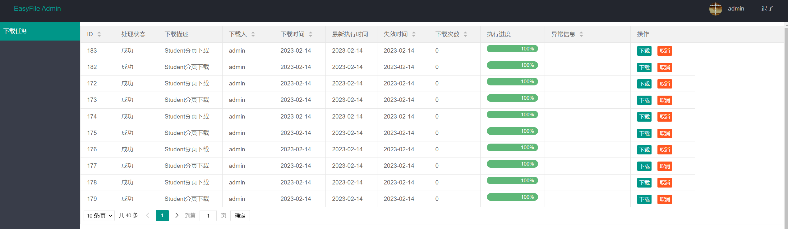

### 使用教程

#### 一、引入maven依赖

如果使用本地模式 引入maven

```xml
<dependency>
    <groupId>com.openquartz</groupId>
    <artifactId>easyfile-spring-boot-starter-local</artifactId>
    <version>1.4.0</version>
</dependency>
```

如果使用remote模式引入maven 依赖

```xml
<dependency>
    <groupId>com.openquartz</groupId>
    <artifactId>easyfile-spring-boot-starter-remote</artifactId>
    <version>1.4.0</version>
</dependency>
```

#### 二、Client端需要提供文件上传服务进行实现接口

```java
package com.openquartz.easyfile.storage.file;

import java.io.File;
import com.openquartz.easyfile.common.bean.Pair;

/**
 * 文件上传服务
 *
 * @author svnee
 */
public interface UploadService {

    /**
     * 文件上传
     * 如果需要重试则需要抛出 com.openquartz.easyfile.core.exception.GenerateFileException
     *
     * @param file 文件
     * @param fileName 自定义生成的文件名
     * @param appId 服务ID
     * @return key: 文件系统 --> value:返回文件URL/KEY标识符
     */
    Pair<String, String> upload(File file, String fileName, String appId);

}
```

将文件上传到自己的文件存储服务

#### 三、SpringBoot 启动入口处理

增加注解扫描 `com.openquartz.easyfile.starter.annotation.EnableEasyFileAutoConfiguration`包在服务的启动入口上

例如：

```java
/**
 * @author svnee
 **/
@SpringBootApplication
@EnableEasyFileAutoConfiguration
@MapperScan("com.openquartz.easyfile.example.mapper")
public class LocalExampleApplication {

    public static void main(String[] args) {
        SpringApplication.run(LocalExampleApplication.class);
    }
}
```

#### 四、额外处理

如果是使用Local模式，需要提供Client配置

```properties
##### easyfile-local-datasource
easyfile.local.datasource.type=com.zaxxer.hikari.HikariDataSource
easyfile.local.datasource.driver-class-name=com.mysql.cj.jdbc.Driver
easyfile.local.datasource.url=jdbc:mysql://localhost:3306/test?characterEncoding=utf-8&zeroDateTimeBehavior=convertToNull&transformedBitIsBoolean=true&serverTimezone=GMT%2B8
easyfile.local.datasource.username=root
easyfile.local.datasource.password=123456
```

需要执行SQL:

```sql
CREATE TABLE ef_async_file_task
(
    id                BIGINT (20) UNSIGNED NOT NULL AUTO_INCREMENT COMMENT 'id',
    task_code         VARCHAR(50) NOT NULL DEFAULT '' COMMENT '任务编码',
    task_desc         VARCHAR(50) NOT NULL DEFAULT '' COMMENT '任务描述',
    app_id            VARCHAR(50) NOT NULL DEFAULT '' COMMENT '归属系统 APP ID',
    unified_app_id    VARCHAR(50) NOT NULL DEFAULT '' COMMENT '统一APP ID',
    enable_status     TINYINT (3) NOT NULL DEFAULT 0 COMMENT '启用状态',
    limiting_strategy VARCHAR(50) NOT NULL DEFAULT '' COMMENT '限流策略',
    version           INT (10) NOT NULL DEFAULT 0 COMMENT '版本号',
    create_time       TIMESTAMP   NOT NULL DEFAULT CURRENT_TIMESTAMP COMMENT '创建时间',
    update_time       TIMESTAMP   NOT NULL DEFAULT CURRENT_TIMESTAMP ON UPDATE CURRENT_TIMESTAMP COMMENT '更新时间',
    create_by         VARCHAR(50) NOT NULL DEFAULT '' COMMENT '创建人',
    update_by         VARCHAR(50) NOT NULL DEFAULT '' COMMENT '更新人',
    deleted        BIGINT (20) NOT NULL DEFAULT 0 COMMENT '是否删除',
    PRIMARY KEY (id),
    UNIQUE KEY `uniq_app_id_task_code` (`task_code`,`app_id`) USING BTREE
)ENGINE=InnoDB DEFAULT CHARSET=utf8mb4 COMMENT '异步下载任务';

CREATE TABLE ef_async_file_record
(
    id                    BIGINT (20) UNSIGNED NOT NULL AUTO_INCREMENT COMMENT 'id',
    task_id      BIGINT (20) NOT NULL DEFAULT 0 COMMENT '下载任务ID',
    app_id                VARCHAR(50)  NOT NULL DEFAULT '' COMMENT 'app ID',
    executor_code         VARCHAR(50)  NOT NULL DEFAULT '' COMMENT '下载code',
    handle_status         VARCHAR(50)  NOT NULL DEFAULT '' COMMENT '上传状态',
    file_url              VARCHAR(512) NOT NULL DEFAULT '' COMMENT '文件路径',
    file_system           VARCHAR(50)  NOT NULL DEFAULT '' COMMENT '文件所在系统',
    operate_by   VARCHAR(50)  NOT NULL DEFAULT '' COMMENT '下载操作人',
    operate_name VARCHAR(50)  NOT NULL DEFAULT '' COMMENT '下载操作人',
    remark                VARCHAR(50)  NOT NULL DEFAULT '' COMMENT '备注',
    notify_enable_status  TINYINT (3) NOT NULL DEFAULT 0 COMMENT '通知启用状态',
    notify_email          VARCHAR(50)  NOT NULL DEFAULT '' COMMENT '通知有效',
    max_server_retry      TINYINT(3) NOT NULL DEFAULT 0 COMMENT '最大服务重试',
    current_retry         TINYINT(3) NOT NULL DEFAULT 0 COMMENT '当前重试次数',
    execute_param         TEXT NULL COMMENT '重试执行参数',
    error_msg             VARCHAR(256) NOT NULL DEFAULT '' COMMENT '异常信息',
    last_execute_time     DATETIME NULL COMMENT '最新执行时间',
    invalid_time          DATETIME NULL COMMENT '链接失效时间',
    download_num          TINYINT(3) NOT NULL DEFAULT 0 COMMENT '下载次数',
    execute_process       TINYINT(3) NOT NULL DEFAULT 0 COMMENT '执行进度',
    version               INT (10) NOT NULL DEFAULT 0 COMMENT '版本号',
    create_time           TIMESTAMP    NOT NULL DEFAULT CURRENT_TIMESTAMP COMMENT '创建时间',
    update_time           TIMESTAMP    NOT NULL DEFAULT CURRENT_TIMESTAMP ON UPDATE CURRENT_TIMESTAMP COMMENT '更新时间',
    create_by             VARCHAR(50)  NOT NULL DEFAULT '' COMMENT '创建人',
    update_by             VARCHAR(50)  NOT NULL DEFAULT '' COMMENT '更新人',
    PRIMARY KEY (id),
    KEY                   `idx_operate_by` (`operate_by`) USING BTREE,
    KEY                   `idx_operator_record` (`operate_by`,`app_id`,`create_time`),
    KEY                   `idx_upload_invalid` (`handle_status`,`invalid_time`,`id`),
    KEY                   `idx_create_time` (`create_time`)
)ENGINE=InnoDB DEFAULT CHARSET=utf8mb4 COMMENT '异步下载记录';
```

如果是使用remote服务，需要部署easyfile-server 服务,Client提供配置

```properties
#### easyfile-storage-remote
easyfile.remote.username=example
easyfile.remote.password=example
easyfile.remote.server-addr=127.0.0.1:8080
easyfile.remote.namespace=remote-example
```

#### 五、异步文件处理器

[异步文件处理器配置](./AsyncFileHandler.md)

#### 六、实现下载器

[下载器](./BaseDownloadExecutror.md)

#### 七、Admin-管理界面

EasyFile 提供了一个简单的Admin管理界面（@since 1.2.0）。 如需开启需要引入maven

```xml

<dependency>
    <groupId>com.openquartz</groupId>
    <artifactId>easyfile-ui</artifactId>
    <version>1.2.0</version>
</dependency>
```

服务监控路径地址为: ip+port/easyfile-ui/ 例如：`localhost:8080/easyfile-ui/` 服务默认Admin用户账户密码为: `admin / admin`

如果需要更改可以配置：

```properties
easyfile.ui.admin.username=admin
easyfile.ui.admin.password=admin
```

EasyFile UI 管理界面



#### 八、easyfile-server 部署

如果使用**Remote模式**时,需要部署easyfile-server服务;

否则不需要进行部署

1、执行存储DB SQL \
2、部署服务
